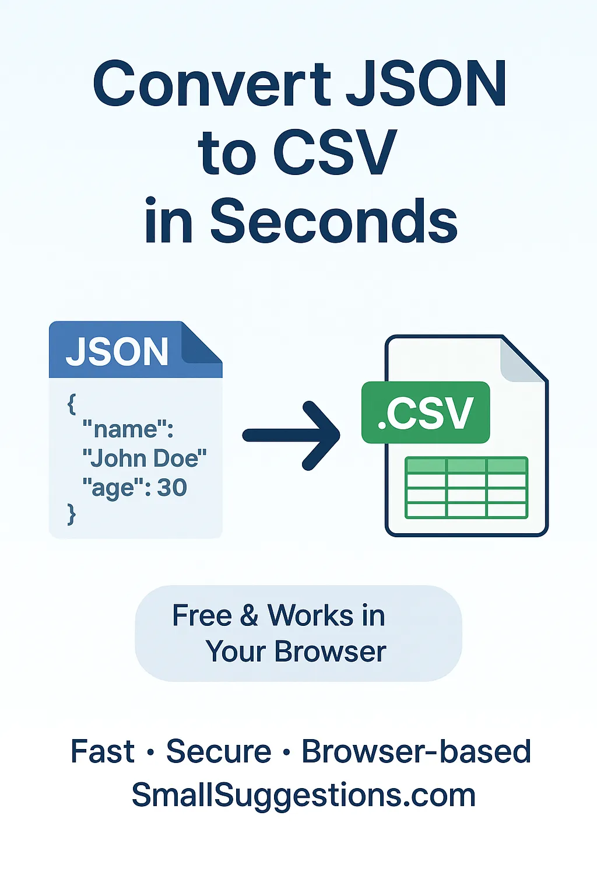
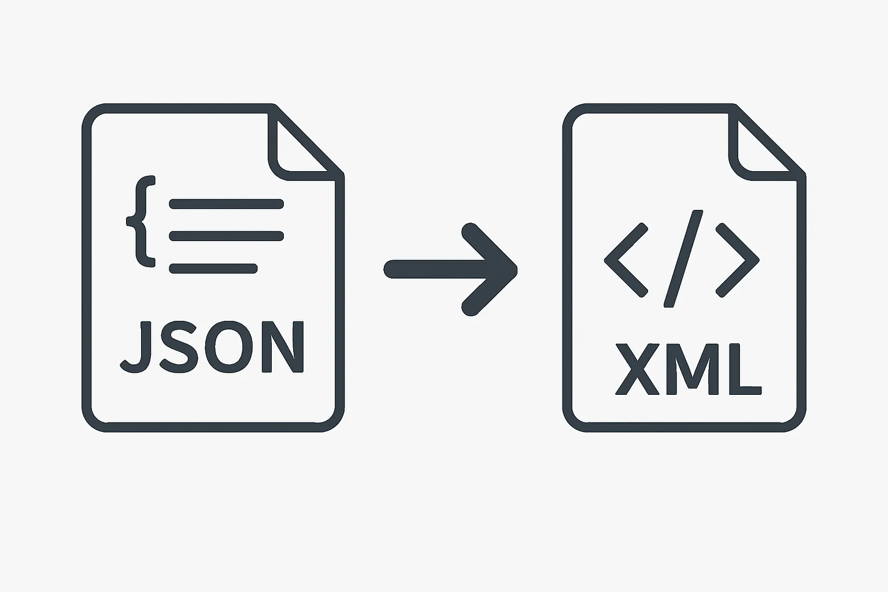
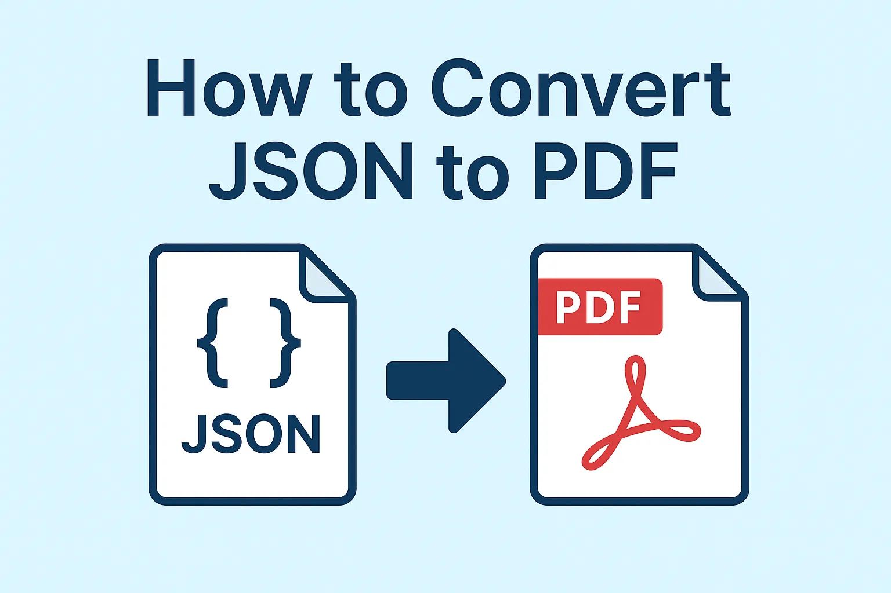

<!-- Schema: ItemList -->

<!-- Schema: BreadcrumbList -->

<!-- Schema: WebPage -->

<!-- Blog Page Layout -->
<section style="width: 100%; padding: 3rem 1rem;">
  <h1 style="text-align: center; font-size: 2rem; margin-bottom: 1rem;">
    Reptile Birds Blog — Explore Data Conversions
  </h1>
  

    Welcome to the <strong>Reptile Birds Blog</strong> — your go-to source for articles about
    data conversion tools and guides to faster your workflow. WWW
  

   

</section>

<section class="blog-list">

<article class="blog-post">
  <a href="how-to-open-json-file-in-excel" class="blog-post-link">
    <figure class="blog-post-image">
      
    </figure>
    

      <h2 class="blog-post-title">How to Open JSON File in Excel</h2>
      

        Wondering how to open a JSON file in Excel easily? This step-by-step guide shows you how to turn any JSON file into a clean, readable Excel sheet without errors, using simple methods and our free online converter.
      

      

        
        Sohail Anwar
        December 07, 2025
      

    

  </a>
</article>

<article class="blog-post">
  <a href="how-to-convert-json-to-csv" class="blog-post-link">
    <figure class="blog-post-image">
      
    </figure>
    

      <h2 class="blog-post-title">How to Convert JSON to CSV</h2>
      

        Need to turn a JSON file into CSV format? This beginner-friendly guide walks you through the easiest methods, from Excel and code editors to our fast, privacy-focused online JSON to CSV converter.
      

      

        
        Sohail Anwar
        December 08, 2025
      

    

  </a>
</article>

<article class="blog-post">
  <a href="how-to-convert-json-to-xml" class="blog-post-link">
    <figure class="blog-post-image">
      
    </figure>
    

      <h2 class="blog-post-title">How to Convert JSON to XML</h2>
      

        Looking to transform JSON data into XML format? This guide explains the simplest methods using editors, built-in tools, and our fast JSON to XML converter—all with clear steps and zero confusion.
      

      

        
        Sohail Anwar
        December 09, 2025
      

    

  </a>
</article>

<article class="blog-post">
  <a href="how-to-convert-json-to-pdf" class="blog-post-link">
    <figure class="blog-post-image">
      
    </figure>
    

      <h2 class="blog-post-title">How to Convert JSON to PDF</h2>
      

        Need to convert JSON data into PDF format quickly? This guide walks you through easy methods using online tools, editors, and our fast JSON to PDF converter, making the process smooth and error-free.
      

      

        
        Gourav Mishra
        December 01, 2025
      

    

  </a>
</article>

</section>

