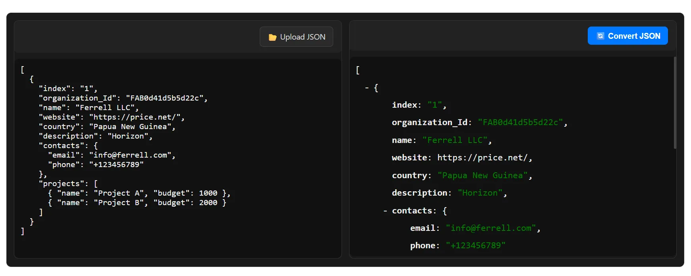
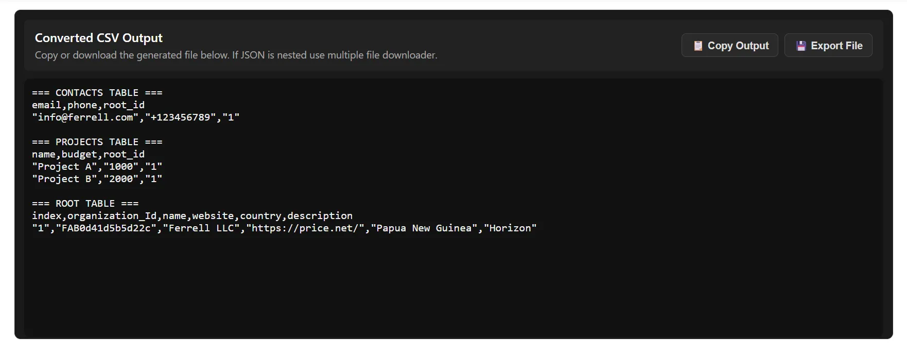

  

  

    <h1 id="intro-heading">How to Convert a JSON to CSV - Easy Steps</h1>
    <section class="blog-intro" aria-labelledby="intro-heading">
      

        Working with JSON data is common for developers and analysts, but turning it into a readable CSV file can be tricky without the right tools. JSON stores information in nested objects and arrays, while CSV files are flat tables. Knowing the proper way to convert JSON to CSV saves time, avoids errors, and makes your data ready for Excel or other spreadsheet applications.
      

   

        <a href="sohail-anwar" style="display:flex; gap: 10px;" class="link">
          
          Sohail Anwar
        </a>
        December 08, 2025
    

  <figure class="blog-image">
        
        <figcaption style="margin-top: -1.5rem; margin-bottom: 1rem; font-size: 8px">How to Convert JSON to Excel</figcaption>
 </figure>
  

        In this guide, we’ll cover multiple ways to convert JSON to CSV, including Excel’s built-in tools, extensions for programming editors, and our fast, privacy-focused online tool. You’ll learn step-by-step methods to ensure clean, structured CSV output every time.
      

  <aside class="blog-tool-tip" aria-label="Recommended JSON to CSV Tool">
        

          For a quick and reliable solution, try our 
          <a href="/json-to-csv" title="JSON to CSV Converter" class="link">browser-based JSON to CSV converter</a>. It works fully in your browser, keeps your data private, and produces well-formatted CSV files instantly.
        

      </aside>
    </section>

 <section aria-labelledby="tricky-heading">
      <h2 id="tricky-heading">Why Converting JSON to CSV Can Be Tricky</h2>
      

        JSON data often contains nested objects or arrays, which do not translate directly into the flat rows and columns of a CSV file. Without proper handling, this can lead to incomplete data, missing fields, or misaligned rows. Understanding these challenges helps you choose the best conversion method.
      

      <ul>
        <li>Nested arrays may require flattening to appear properly in CSV.</li>
        <li>Large JSON files can cause performance issues in spreadsheet software.</li>
        <li>Different tools or programming editors handle JSON differently.</li>
      </ul>
    </section>

   <section aria-labelledby="method1-heading">
      <h2 id="method1-heading">Method 1: Using Excel’s Built-In Tools (Power Query)</h2>
      

        Excel includes <strong>Power Query</strong> (Get & Transform Data), which allows direct JSON import. This method works well for structured JSON and is ideal if you prefer not to use additional software or extensions.
      

      
   <h3>Step-by-Step Guide:</h3>
      <ol>
        <li>Open Excel and navigate to <strong>Data &gt; Get Data &gt; From File &gt; From JSON</strong>.</li>
        <li>Select your JSON file and click <strong>Import</strong>.</li>
        <li>Excel shows a preview of your data. Use <strong>Transform Data</strong> to flatten nested structures as needed.</li>
        <li>Click <strong>Load</strong> to create the CSV or table in your spreadsheet.</li>
      </ol>

   
<em>Pro Tips:</em>

      <ul>
        <li>Large JSON files may take longer to load — consider splitting them for efficiency.</li>
        <li>Ensure nested objects are flattened to fit CSV’s tabular format.</li>
        <li>Menu names may vary by Excel version; check your version for exact steps.</li>
      </ul>
    </section>

   <section aria-labelledby="method2-heading">
      <h2 id="method2-heading">Method 2: Convert JSON to CSV Using Our Online Tool</h2>
      

        For a fast, browser-based approach, use our 
        <a href="/json-to-csv" class="link" title="JSON to CSV Converter">JSON to CSV converter</a>. Upload your JSON file and get a structured CSV file instantly, without installing software or sharing your data.
      

   <h3>How to Use the Converter</h3>
      <ol>
        <li>
          <strong>Upload or Paste Your JSON:</strong> Paste your JSON or click <strong>Upload JSON</strong>.  
          <figure class="blog-image">
            
            <figcaption>Paste or upload your JSON file</figcaption>
          </figure>
        </li>
        <li>
          <strong>Convert and Download CSV:</strong> Click <strong>Convert JSON</strong> to generate your CSV. Nested structures are handled automatically.  
          <figure class="blog-image">
            
            <figcaption>Download your CSV file</figcaption>
          </figure>
        </li>
      </ol>

   <h3>Use Cases</h3>
      <ul>
        <li>Transforming API JSON data for reports and analysis.</li>
        <li>Handling GST, ITR, or AIS JSON files for accountants and professionals.</li>
        <li>Converting JSON exported from software apps into CSV for further processing.</li>
      </ul>

   <aside class="blog-tool-tip" aria-label="Try the JSON to CSV Converter">
        

          Try the <a href="/json-to-csv" class="link" title="JSON to CSV Converter">JSON to CSV converter</a> today — fast, secure, and no installation required.
        

      </aside>
    </section>

  <section aria-labelledby="tips-heading">
      <h2 id="tips-heading">Tips for Converting JSON to CSV Effectively</h2>
      <ul>
        <li><strong>Flatten Nested Data:</strong> Use tools that automatically handle nested objects and arrays.</li>
        <li><strong>Ensure Column Consistency:</strong> Check that all JSON objects have the same keys.</li>
        <li><strong>Use UTF-8 Encoding:</strong> Prevent garbled text in CSV files.</li>
        <li><strong>Split Large Files:</strong> Improves performance and prevents crashes.</li>
        <li><strong>Preview Your Data:</strong> Verify before converting to CSV.</li>
      </ul>
    </section>

   <section aria-labelledby="errors-heading">
      <h2 id="errors-heading">Common Errors When Converting JSON to CSV and How to Fix Them</h2>
      <ul>
        <li><strong>Parsing Errors:</strong> Validate JSON before converting.</li>
        <li><strong>Blank Cells:</strong> Ensure all objects have consistent keys; use converter for automatic handling.</li>
        <li><strong>Special Characters:</strong> Save JSON in UTF-8 to avoid encoding issues.</li>
      </ul>
    </section>

   <section aria-labelledby="conclusion-heading">
      <h2 id="conclusion-heading">Conclusion: Choose the Best Method for Your Needs</h2>
      

        Whether using Excel’s built-in tools or our 
        <a href="/json-to-csv" title="JSON to CSV Converter" class="link">browser-based JSON to CSV converter</a>, you can convert any JSON file to CSV quickly and reliably. For large or nested datasets, our online tool is the fastest, most convenient option.
      

    </section>
    <section aria-labelledby="faq-heading-json-csv">
  <h2 id="faq-heading-json-csv">FAQs: How to Convert JSON to CSV</h2>

  

    
What is the easiest way to convert JSON to CSV?

    

      The easiest way is to use a browser-based JSON to CSV converter. Simply upload your JSON file, and the tool will automatically flatten nested objects and arrays, producing a ready-to-use CSV file for Excel or other spreadsheet software.
    

  

  

    
Can Excel convert JSON files to CSV directly?

    

      Excel cannot directly save JSON files as CSV. You can import JSON using Power Query (Get & Transform Data), transform nested data into a tabular format, and then export it as CSV.
    

  

  

    
How to convert JSON to CSV using VS Code?

    

      Install a JSON extension in VS Code, such as “Excel JSON Converter” or “JSON Tools.” Open your JSON file, use the extension to flatten the data, and export it as CSV for use in Excel or Google Sheets.
    

  

  

    
Why do nested JSON objects appear incorrectly in CSV?

    

      Nested objects or arrays can break the CSV format because CSV only supports flat tabular data. Use a converter or script that automatically creates separate rows or columns for nested structures.
    

  

  

    
How can I preview JSON data before converting to CSV?

    

      Use online preview tools or JSON viewers in VS Code to inspect your JSON structure. This helps ensure consistent keys and proper formatting before exporting to CSV.
    

  

  

    
Is it possible to automate JSON to CSV conversion?

    

      Yes, automation can be done using scripting languages like Python with Pandas, Node.js scripts, or Excel macros. For one-time conversions, browser-based tools are faster and simpler.
    

  

  

    
Can I convert large JSON files to CSV without crashing Excel?

    

      Large files can be challenging. Use a dedicated JSON to CSV converter that processes data client-side in your browser or a script that handles chunked processing. This prevents Excel from slowing down or crashing.
    

  

  

    
Which file formats are supported after conversion?

    

      Most converters export to <strong>CSV</strong> or <strong>XLSX</strong>. You can then open the file in Excel, Google Sheets, or other spreadsheet programs.
    

  

  

    
How to handle missing keys when converting JSON to CSV?

    

      Missing keys in JSON objects can create blank cells in CSV. Use a converter that automatically fills missing columns or ensure consistency in your JSON structure before conversion.
    

  

  

    
Can I use our JSON to Excel converter to get CSV?

    

      Yes, you can use our <a href="/json-to-excel" title="JSON to Excel Converter" class="link">JSON to Excel converter</a> and then save the resulting Excel file as CSV. It ensures structured, clean, and accurate output for nested JSON.
    

  

</section>

 

  <label style="margin: 3rem;">Related Blog Posts</label>
  <ul style="margin-left: 2rem;">
   <li><a href ="how-to-open-json-file-in-excel" class="link">Open JSON In Excel</a></li>
   <li><a href ="how-to-convert-json-to-xml" class="link">Convert JSON To XML</a></li>
   <li><a href ="how-to-convert-json-to-pdf" class="link">Convert JSON To PDF</a></li>
  </ul>

 

