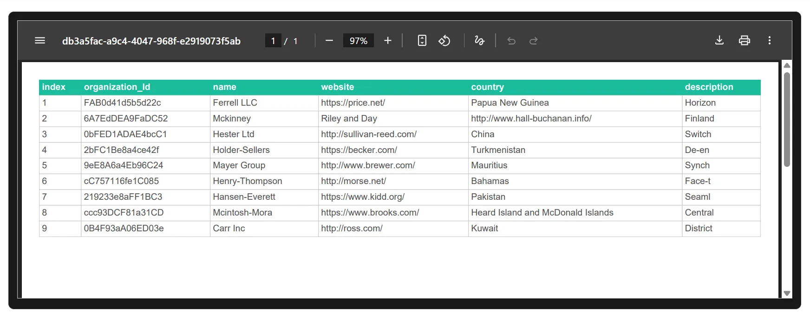

  

  

  <h1 id="how-to-convert-pdf-to-json">How To Convert JSON To PDF - The Best Methods</h1>
  <section class="blog-intro" aria-labelledby="convert-json-to-pdf">
  
JSON data can be a little complex for non-technical users. Converting it to PDF makes it more readable, shareable, and easy to understand.

<blockquote>Tip: Tabular PDF format is often more readable than raw JSON.</blockquote>

     <a href="gourav-mishra" style="display:flex; gap: 10px;" class="link">
      
      Gourav Mishra
      </a>
      December 01, 2025
    

  <figure class="blog-image">
        
<svg width="100%" height="265px" xmlns="http://www.w3.org/2000/svg" style="border: 2px solid orange; background-color: black;">
  <!-- Background -->
  <rect width="100%" height="100%" fill="#f0f0f0"/>

  <!-- Left panel (JSON Array) -->
  <rect x="0" y="0" width="50%" height="100%" fill="#e0f7fa"/>
  <text x="10" y="15" font-family="monospace" font-size="10" fill="#00796b">[</text>

  <text x="20" y="25" font-family="monospace" font-size="10" fill="#00796b">{</text>
  <text x="30" y="35" font-family="monospace" font-size="10" fill="#00796b">"name": "Sohail",</text>
  <text x="30" y="50" font-family="monospace" font-size="10" fill="#00796b">"age": 34,</text>
  <text x="30" y="65" font-family="monospace" font-size="10" fill="#00796b">"role": "Software Engineer"</text>
  <text x="20" y="75" font-family="monospace" font-size="10" fill="#00796b">},</text>

  <text x="20" y="95" font-family="monospace" font-size="10" fill="#00796b">{</text>
  <text x="30" y="115" font-family="monospace" font-size="10" fill="#00796b">"name": "Saeed",</text>
  <text x="30" y="129" font-family="monospace" font-size="10" fill="#00796b">"age": 30,</text>
  <text x="30" y="145" font-family="monospace" font-size="10" fill="#00796b">"role": "Software Engineer"</text>
  <text x="20" y="160" font-family="monospace" font-size="10" fill="#00796b">},</text>

  <text x="20" y="180" font-family="monospace" font-size="10" fill="#00796b">{</text>
  <text x="30" y="200" font-family="monospace" font-size="10" fill="#00796b">"name": "Gourav",</text>
  <text x="30" y="215" font-family="monospace" font-size="10" fill="#00796b">"age": 32,</text>
  <text x="30" y="230" font-family="monospace" font-size="10" fill="#00796b">"role": "Business Analyst"</text>
  <text x="20" y="240" font-family="monospace" font-size="10" fill="#00796b">}</text>

  <text x="10" y="250" font-family="monospace" font-size="10" fill="#00796b">]</text>

  <!-- Right panel (PDF viewer) -->
  <rect x="50%" y="10" width="48%" height="245" rx="4" ry="4" fill="#fff" stroke="#bbb" stroke-width="1"/>
  <!-- PDF Toolbar -->
  <rect x="50%" y="10" width="48%" height="30" fill="#e0e0e0" stroke="#ccc" stroke-width="1"/>
  <circle cx="52%" cy="25" r="4" fill="#f44336"/>
  <circle cx="55%" cy="25" r="4" fill="#ffeb3b"/>
  <circle cx="58%" cy="25" r="4" fill="#4caf50"/>
  <text x="62%" y="28" font-family="sans-serif" font-size="12" fill="#555">Document.pdf</text>

  <!-- PDF Table header -->
  <rect x="51%" y="50" width="46%" height="25" fill="#3949ab"/>
  <text x="53%" y="68" font-family="sans-serif" font-size="13" fill="#fff">Name</text>
  <text x="65%" y="68" font-family="sans-serif" font-size="13" fill="#fff">Age</text>
  <text x="75%" y="68" font-family="sans-serif" font-size="13" fill="#fff">Role</text>

  <!-- PDF Table rows -->
  <rect x="51%" y="75" width="46%" height="25" fill="#f5f5f5"/>
  <text x="53%" y="92" font-family="sans-serif" font-size="13" fill="#000">Sohail</text>
  <text x="65%" y="92" font-family="sans-serif" font-size="13" fill="#000">34</text>
  <text x="75%" y="92" font-family="sans-serif" font-size="13" fill="#000">Software Engineer</text>

  <rect x="51%" y="100" width="46%" height="25" fill="#ffffff"/>
  <text x="53%" y="117" font-family="sans-serif" font-size="13" fill="#000">Saeed</text>
  <text x="65%" y="117" font-family="sans-serif" font-size="13" fill="#000">30</text>
  <text x="75%" y="117" font-family="sans-serif" font-size="13" fill="#000">Software Engineer</text>

  <rect x="51%" y="125" width="46%" height="25" fill="#f5f5f5"/>
  <text x="53%" y="142" font-family="sans-serif" font-size="13" fill="#000">Gourav</text>
  <text x="65%" y="142" font-family="sans-serif" font-size="13" fill="#000">32</text>
  <text x="75%" y="142" font-family="sans-serif" font-size="13" fill="#000">Business Analyst</text>

  <!-- Faint row borders -->
  <line x1="51%" y1="75" x2="97%" y2="75" stroke="#ddd" stroke-width="1"/>
  <line x1="51%" y1="100" x2="97%" y2="100" stroke="#ddd" stroke-width="1"/>
  <line x1="51%" y1="125" x2="97%" y2="125" stroke="#ddd" stroke-width="1"/>
</svg>

 </figure>

If you want to convert JSON to PDF quickly and securely, try our <a href="/json-to-pdf" class="link">JSON To PDF Converter</a>. It is fully browser-based, private, and fast, so no software installation is needed. Even complex, nested JSON is handled automatically, with sub-tables created in the PDF for nested data, making it readable and well-structured.

We will explore here the different ways to convert JSON into PDF. This guide will cover multiple approaches, highlighting their advantages, limitations, and the challenges that may occur during conversion. Converting JSON to PDF is a common requirement for business reporting, data analysis, and sharing structured information in a readable format. Whether the JSON is simple or complex, nested or flat, understanding the different methods helps you choose the most effective approach for your needs. By the end of this tutorial, you will have a clear understanding of how JSON data can be transformed into well-structured, professional PDF documents.

</section>
 
 <section id="manual-json-to-pdf" aria-label="Manual steps to convert JSON to PDF using Word or OpenOffice">
  <h2 id="manual-json-to-pdf-heading">Manually Convert JSON to PDF (Word or OpenOffice)</h2>
  
  
Manually converting JSON to PDF is a good approach for small or moderately sized JSON files. It works for both plain and nested JSON, allowing you to create readable tables and sub-tables for nested objects. However, there are real-world limitations and challenges you should be aware of:

  
  <ul>
    <li>Manual conversion is time-consuming for large JSON files with many keys or deeply nested arrays.</li>
    <li>Nested objects require sub-tables inside main table cells, which can break across pages if not carefully aligned.</li>
    <li>Separate tables for each nested object increase page length and reduce readability.</li>
    <li>Formatting issues like column widths, page breaks, and alignment can require multiple iterations.</li>
    <li>Human error is likely when copying data manually, especially for large or complex datasets.</li>
  </ul>

  
<strong>Recommendation:</strong> If your JSON file is large, contains multiple values, or has deeply nested structures, manual conversion is not practical. Automated tools are better suited to handle complex data efficiently without errors, ensuring professional, structured PDFs.

  <article id="step-1" aria-label="Step 1: Understand Your JSON">
    <h3>Step 1: Understand Your JSON</h3>
    
Examine your JSON data. Plain JSON example:

    <pre>
{
  "name": "John Doe",
  "age": 47,
  "role": "Software Scientist"
}
    </pre>
    
Nested JSON example:

    <pre>
{
  "name": "John Doe",
  "age": 47,
  "role": "Software Scientist",
  "projects": [
    {"title": "Project Alpha", "status": "Completed"},
    {"title": "Project Beta", "status": "Ongoing"}
  ]
}
    </pre>
  </article>

  <article id="step-2" aria-label="Step 2: Open Word or OpenOffice">
    <h3>Step 2: Open Word or OpenOffice</h3>
    <ul>
      <li>Launch Word or OpenOffice Writer and create a new blank document.</li>
      <li>Set page layout: <strong>Layout → Margins → Normal</strong>.</li>
      <li>Choose portrait or landscape orientation depending on table width.</li>
    </ul>
  </article>

  <article id="step-3" aria-label="Step 3: Create Table and Columns">
    <h3>Step 3: Create Table and Columns</h3>
    <ul>
      <li>Plain JSON: Insert a table with 2 columns (Key, Value). Each row represents a key-value pair.</li>
      <li>Nested JSON: Insert sub-tables for arrays or nested objects inside the main table cell. Columns in sub-tables correspond to object fields.</li>
    </ul>
  </article>

  <article id="step-4" aria-label="Step 4: Fill Table with Data">
    <h3>Step 4: Fill Table with Data</h3>
    <ul>
      <li>Enter JSON keys and values into the table row by row.</li>
      <li>For nested arrays, fill sub-tables row by row.</li>
      <li>Adjust fonts, alignment, and column widths for readability.</li>
    </ul>
  </article>

  <article id="step-5" aria-label="Step 5: Export as PDF">
    <h3>Step 5: Export as PDF</h3>
    <ul>
      <li>Word: <strong>File → Save As → Save as type → PDF (*.pdf)</strong></li>
      <li>OpenOffice: <strong>File → Export as PDF</strong></li>
      <li>Verify layout, page breaks, and table alignment before saving.</li>
    </ul>
  </article>

  <article id="step-6" aria-label="Step 6: Review and Adjust">
    <h3>Step 6: Review and Adjust</h3>
    <ul>
      <li>Check that all JSON data, including nested objects, is represented correctly.</li>
      <li>Adjust tables, fonts, and page breaks for clarity.</li>
    </ul>
  </article>

  
In summary, manual conversion works best for small to medium JSON files. For large files with multiple values, deeply nested objects, or complex structures, manual methods are inefficient, prone to errors, and can result in poorly formatted PDFs. In such cases, automated JSON-to-PDF tools are strongly recommended.

</section>

<section id="json-to-pdf-tool" aria-label="Convert JSON to PDF using our online tool">
  <h2 id="json-to-pdf-tool-heading">Convert JSON to PDF Using Our Tool</h2>

  
You can quickly convert JSON to PDF using our <a href="/json-to-pdf" class="link">JSON-to-PDF tool</a>. Simply paste your JSON data or upload a <code>.json</code> file. The tool validates your input and shows a structured preview so you can check how your PDF will look before exporting.

  <article id="input-preview" aria-label="JSON Input and Live Preview">
    <h3>Step 1: Input Your JSON</h3>
    
Add your JSON data into the editor. It works with both plain and nested JSON:

    <figure class="blog-image">
      
      <figcaption>Paste or upload your JSON file</figcaption>
    </figure>
    
The live editor highlights any issues and ensures your JSON is ready for conversion.

  </article>

  <article id="convert-to-pdf" aria-label="Convert JSON to PDF">
    <h3>Step 2: Preview and Convert</h3>
    
Click <strong>Convert JSON</strong> to generate a PDF. A live preview appears so you can check the layout, tables, and nested objects before downloading.

    <figure class="blog-image">
      
      <figcaption>Live PDF preview before download</figcaption>
    </figure>
  </article>

  <article id="key-features" aria-label="Key Features of JSON to PDF Tool">
    <h3>Key Features</h3>
    <ul>
      <li><strong>Instant Preview:</strong> Check JSON structure before exporting.</li>
      <li><strong>Nested Data Handling:</strong> Automatically flattens complex objects and arrays.</li>
      <li><strong>Secure & Private:</strong> All processing happens in your browser; your data never leaves your device.</li>
      <li><strong>Smart Table Generation:</strong> Arrays are converted into well-formatted PDF tables.</li>
      <li><strong>Downloadable Output:</strong> Get polished, print-ready PDFs instantly.</li>
      <li><strong>Cross-Platform:</strong> Works on Windows, macOS, Linux, and mobile browsers.</li>
    </ul>
  </article>

  
With our <a href="/json-to-pdf" class="link">JSON-to-PDF tool</a>, converting JSON into professional PDFs is fast, secure, and simple, whether you are working with small files or complex nested data. Live previews and automatic table formatting ensure your PDFs are ready to share, print, or archive.

</section>

<section id="convert-json-pdf-editors" aria-label="Convert JSON to PDF with Editors and IDEs">
  <h2>Convert JSON to PDF with Editors / IDEs</h2>

  

    Many users prefer converting JSON to PDF through the tools they already use every day. Editors and IDEs offer extensions or plugins that help format, visualize, and export JSON into a readable PDF document. Below are practical options for both technical and non-technical users, along with simple steps, limitations, and real-world challenges you should consider.
  

 
  <!-- VS CODE -->
  <article id="vscode-conversion" aria-label="VS Code JSON to PDF Extensions">
    <h3>Convert JSON To PDF With VS Code</h3>

    <ul>
      <li>
        <strong>Markdown PDF</strong> 
        <em>Steps:</em>  
        - Create a Markdown file.  
        - Paste your JSON inside a fenced code block.  
        - Right-click → <strong>Export PDF</strong>. 
        <em>Limitations & Challenges:</em>  
        - Does not auto-generate tables.  
        - Large or nested JSON becomes unreadable.  
        - Only suitable for simple or small data.
      </li>

      <li>
        <strong>JSON Formatter</strong> 
        <em>Steps:</em>  
        - Open JSON → Format with the extension.  
        - File → Print → Save as PDF. 
        <em>Limitations & Challenges:</em>  
        - Generates code-style output, not business documents.  
        - No support for nested table rendering.  
        - Deep objects create long, cluttered PDFs.
      </li>

      <li>
        <strong>Print Code (Colorized PDF Export)</strong> 
        <em>Steps:</em>  
        - Format JSON.  
        - Print using system dialog → Save as PDF. 
        <em>Limitations & Challenges:</em>  
        - Only exports raw code view.  
        - No table formatting or hierarchy detection.  
        - Not suitable for reports or client documents.
      </li>

      <li>
        <strong>REST Client + Markdown Export</strong> 
        <em>Steps:</em>  
        - Fetch JSON via REST Client.  
        - Save response as Markdown → Export PDF. 
        <em>Limitations & Challenges:</em>  
        - Requires multiple plugins.  
        - Nested JSON requires manual formatting in tables.  
        - Slow for large datasets.
      </li>
    </ul>
  </article>
 
  <!-- JETBRAINS -->
  <article id="jetbrains-conversion" aria-label="JetBrains IDEs JSON to PDF Extensions">
    <h3>Convert JSON To PDF Using JetBrains IDEs</h3>

    <ul>
      <li>
        <strong>HTML Export → PDF</strong> 
        <em>Steps:</em>  
        - Open JSON → Export to HTML.  
        - Print the HTML → Save as PDF. 
        <em>Limitations & Challenges:</em>  
        - No control over complex formatting.  
        - Nested arrays are shown as plain text.  
        - Hard to use for multi-layered JSON.
      </li>

      <li>
        <strong>Asciidoc Plugin</strong> 
        <em>Steps:</em>  
        - Place JSON inside Asciidoc blocks.  
        - Export → PDF. 
        <em>Limitations & Challenges:</em>  
        - Requires writing Asciidoc manually.  
        - No automatic table creation.  
        - Difficult for large datasets.
      </li>

      <li>
        <strong>Markdown Navigator</strong> 
        <em>Steps:</em>  
        - Insert JSON as code blocks.  
        - Export to PDF. 
        <em>Limitations & Challenges:</em>  
        - Good for small JSON only.  
        - Nested structures impossible to express clearly.  
        - No visual grouping or sub-tables.
      </li>

      <li>
        <strong>CSV / JSON Utilities</strong> 
        <em>Steps:</em>  
        - Convert JSON → CSV using a plugin.  
        - Open CSV in table view → Print PDF. 
        <em>Limitations & Challenges:</em>  
        - Flattens data (destroys hierarchy).  
        - Cannot represent nested children.  
        - Poor choice for real-world complex JSON.
      </li>
    </ul>
  </article>
 
  <!-- LIBREOFFICE -->
  <article id="libreoffice-conversion" aria-label="LibreOffice JSON to PDF Extensions">
    <h3>Convert JSON To PDF Using LibreOffice / OpenOffice</h3>

    <ul>
      <li>
        <strong>JSON Import Extensions</strong> 
        <em>Steps:</em>  
        - Import JSON into Writer.  
        - Adjust formatting manually.  
        - Export as PDF. 
        <em>Limitations & Challenges:</em>  
        - No nested table support.  
        - Formatting large JSON takes hours.  
        - Not suitable for dynamic or structured data.
      </li>

      <li>
        <strong>JSON → CSV → Calc</strong> 
        <em>Steps:</em>  
        - Convert JSON externally to CSV.  
        - Open in Calc → Export PDF. 
        <em>Limitations & Challenges:</em>  
        - CSV cannot express nested JSON.  
        - Multiple arrays become broken rows.  
        - Business data loses structure.
      </li>

      <li>
        <strong>Manual Table Editing in Writer</strong> 
        <em>Steps:</em>  
        - Create table manually for each object.  
        - Insert sub-tables for nested JSON.  
        - Export PDF. 
        <em>Limitations & Challenges:</em>  
        - Extremely slow for complex JSON.  
        - Nested tables break layout easily.  
        - Not maintainable for real-world files.
      </li>

      <li>
        <strong>Print-to-PDF</strong> 
        <em>Steps:</em>  
        - Paste formatted JSON text.  
        - Print → Save as PDF. 
        <em>Limitations & Challenges:</em>  
        - Produces raw code-like PDFs.  
        - Zero structure or tables.  
        - Not suitable for reporting.
      </li>
    </ul>
  </article>
 
  <!-- ONLINE EDITORS -->
  <article id="online-code-editors" aria-label="Online Editors JSON to PDF Conversion">
    <h3>Using Online Code Editors (StackBlitz, Monaco, CodeSandbox)</h3>

    <ul>
      <li>
        <strong>jsPDF Integrations</strong> 
        <em>Steps:</em>  
        - Load JSON in the editor.  
        - Use jsPDF script to generate PDF. 
        <em>Limitations & Challenges:</em>  
        - Requires JavaScript coding.  
        - Manual table creation necessary.  
        - Deeply nested JSON requires recursive functions.
      </li>

      <li>
        <strong>Online JSON Viewers</strong> 
        <em>Steps:</em>  
        - Paste JSON → Pretty print.  
        - Browser → Print PDF. 
        <em>Limitations & Challenges:</em>  
        - Only exports the viewer layout.  
        - No table structures.  
        - Not readable for multi-level JSON.
      </li>

      <li>
        <strong>Markdown Converters</strong> 
        <em>Steps:</em>  
        - Convert JSON → Markdown table manually.  
        - Export PDF. 
        <em>Limitations & Challenges:</em>  
        - Nested arrays require separate tables.  
        - Formatting is extremely time-consuming.  
        - Not feasible for larger JSON.
      </li>

      <li>
        <strong>Beautify → Print-to-PDF</strong> 
        <em>Steps:</em>  
        - Beautify JSON online.  
        - Print as PDF. 
        <em>Limitations & Challenges:</em>  
        - Produces plain formatted text.  
        - Very long PDFs for deep nested data.  
        - Not presentation-ready.
      </li>
    </ul>
  </article>
</section>
 
 <section id="best-json-to-pdf" aria-label="Best Approach to Convert JSON to PDF">
  <h2>What Is the Best Approach to Convert JSON to PDF?</h2>

  

    Converting JSON to PDF can be simple or complex depending on the data structure. For most users—especially those with nested objects or arrays—the fastest and most reliable method is using an online converter like <a href="/json-to-pdf" class="link"> JSON to PDF Converter</a>. It automatically formats data into structured tables, preserves hierarchy, and provides a live preview before downloading.
  

  <article id="non-technical-approach" aria-label="Approach for Non-Technical Users">
    <h3>For Non-Technical Users</h3>
    

      Simply paste or upload your JSON and download a clean, readable PDF. No installation, coding, or plugins are required. This approach saves time, avoids errors, and is ideal for one-off conversions or small datasets.
    

  </article>

  <article id="technical-approach" aria-label="Approach for Developers and Technical Users">
    <h3>For Developers</h3>
    

      Developers can use Node.js or Python libraries, IDE extensions, or browser-based tools. While scripts and plugins are helpful for automation, even experienced users often rely on online converters for quick previews or one-time conversions.
    

  </article>

  <article id="manual-approach" aria-label="Manual JSON to PDF Conversion Limitations">
    <h3>Manual Conversion Limitations</h3>
    

      Manual formatting is only practical for very small JSON files. Large or nested data quickly becomes error-prone, time-consuming, and difficult to maintain, often resulting in inconsistent layouts.
    

  </article>
</section>
<section id="json-to-pdf-faqs" aria-label="Frequently Asked Questions about JSON to PDF Conversion">
  <h2>Frequently Asked Questions</h2>

  

    
How to convert JSON to PDF quickly?

    
You can use an online JSON to PDF converter, paste or upload your JSON, preview the structured output, and download a clean PDF instantly.

  

  

    
Can I convert nested JSON objects into tables?

    
Yes, modern online converters automatically handle nested objects and arrays, generating structured tables in the PDF for better readability.

  

  

    
Can you convert large JSON files using editors?

    
While possible, manual conversion in editors like VS Code or LibreOffice is slow and error-prone for large files. Online tools are recommended for big datasets.

  

  

    
Who should use an online JSON to PDF converter?

    
Non-technical users or anyone needing quick, readable PDFs from JSON without coding or plugin installation should use online converters.

  

  

    
What are the limitations of manual conversion?

    
Manual conversion is feasible only for small JSON files. Large or nested JSON quickly becomes time-consuming, difficult to format, and prone to errors.

  

  

    
Why use a browser-based JSON to PDF tool?

    
Browser-based tools are fast, secure, require no installation, handle nested data automatically, and provide live previews before download. Check our <a href="/json-to-pdf" class="link"> JSON to PDF Converter</a>  

  

  

    
How to maintain JSON hierarchy in a PDF?

    
Use a converter that automatically creates nested tables or sub-tables to preserve the parent-child relationships in the PDF.

  

  

    
Can I convert JSON to PDF offline?

    
Yes,Our <a href="/json-to-pdf" class="link"> JSON to PDF Converter</a> provide this. You can also convert using IDE plugins, scripts (Node.js, Python), or tools like LibreOffice. However, setup is required and nested JSON may need manual formatting.

  

  

    
What happens if JSON has multiple arrays?

    
Each array can be converted into a separate table. Some manual formatting may be needed in editors, while online tools automate this process efficiently.

  

  

    
Who should avoid manual JSON to PDF conversion?

    
Anyone working with large, deeply nested, or frequently updated JSON files should avoid manual conversion due to time, error, and maintenance challenges.

  

</section>

  

  

  <label style="margin: 3rem;">Related Articles</label>
  <ul style="margin-left: 2rem;">
   <li><a href ="how-to-convert-json-to-csv" class="link">Convert JSON To CSV</a></li>
   <li><a href ="how-to-open-json-file-in-excel" class="link">Open JSON In Excel</a></li>
   <li><a href ="how-to-convert-json-to-xml" class="link">Convert JSON To XML</a></li>
  </ul>
  

