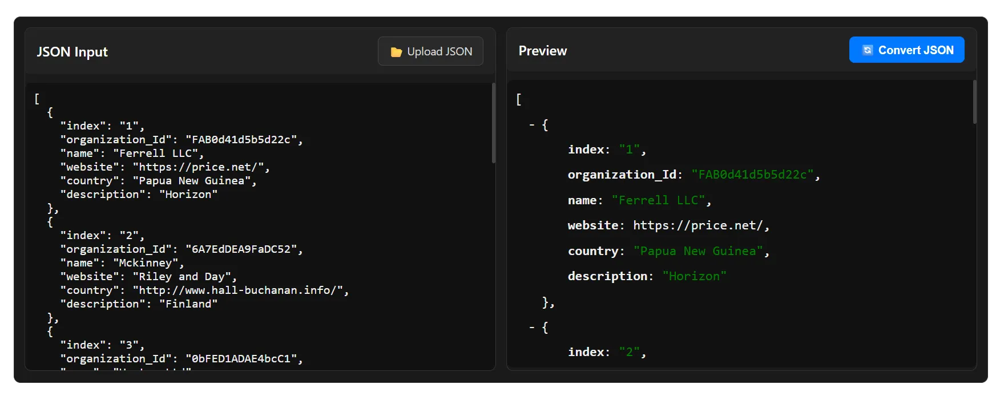
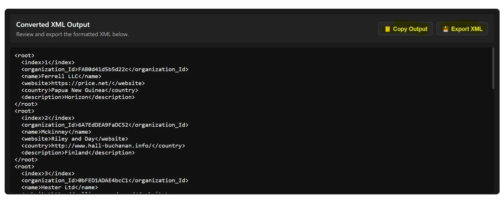

  

  

<h1 id="convert-json-to-xml">How To Convert JSON To XML - The Best Practices</h1>
<section class="blog-intro" aria-labelledby="convert-json-to-xml">
  
Learn the most effective ways to convert JSON files to XML format quickly, accurately, and without errors, whether manually, with tools, or using our browser-based converter.

  

    <a href="sohail-anwar" style="display:flex; gap:10px;" class="link">
      
      Sohail Anwar
    </a>
    December 09, 2025
  

  <figure class="blog-image">
   <svg xmlns="http://www.w3.org/2000/svg" width="100%" height="250px" viewBox="0 0 1024 640" style="border: 1px solid orange; background-color: black;">
  <rect width="100%" height="100%" fill="black"/>

  <!-- Left JSON panel -->
  <g transform="translate(60,80)">
    <rect width="360" height="480" rx="20" fill="#D8EEF8"/>
    <text x="20" y="35" font-family="Inter, Arial" font-size="22" font-weight="600" fill="#0b3b5b">JSON</text>

    <text x="30" y="80" font-family="monospace" font-size="20" fill="#0b3b5b">{</text>

    <text x="50" y="110" font-family="monospace" font-size="18" fill="#0b3b5b">"name": "Alice",</text>
    <text x="50" y="140" font-family="monospace" font-size="18" fill="#0b3b5b">"age": 30,</text>
    <text x="50" y="170" font-family="monospace" font-size="18" fill="#0b3b5b">"items": [1,2,3],</text>
    <text x="50" y="200" font-family="monospace" font-size="18" fill="#0b3b5b">"active": true</text>

    <text x="30" y="230" font-family="monospace" font-size="20" fill="#0b3b5b">}</text>
  </g>

  <!-- Right XML panel -->
  <g transform="translate(604,80)">
    <rect width="360" height="480" rx="20" fill="#DFF6E8"/>
    <text x="20" y="35" font-family="Inter, Arial" font-size="22" font-weight="600" fill="#0b3b50">XML</text>

    <text x="30" y="80" font-family=" Arial" font-size="18" fill="#0b3b50">&lt;person&gt;</text>
    <text x="50" y="110" font-family=" Arial" font-size="16" fill="#0b3b50">&lt;name&gt;Alice&lt;/name&gt;</text>
    <text x="50" y="140" font-family=" Arial" font-size="16" fill="#0b3b50">&lt;age&gt;30&lt;/age&gt;</text>
    <text x="50" y="170" font-family=" Arial" font-size="16" fill="#0b3b50">&lt;items&gt;</text>
    <text x="70" y="200" font-family=" Arial" font-size="16" fill="#0b3b50">&lt;item&gt;1&lt;/item&gt;</text>
    <text x="70" y="225" font-family=" Arial" font-size="16" fill="#0b3b50">&lt;item&gt;2&lt;/item&gt;</text>
    <text x="70" y="250" font-family=" Arial" font-size="16" fill="#0b3b50">&lt;item&gt;3&lt;/item&gt;</text>
    <text x="50" y="280" font-family=" Arial" font-size="16" fill="#0b3b50">&lt;/items&gt;</text>
    <text x="30" y="310" font-family=" Arial" font-size="18" fill="#0b3b50">&lt;/person&gt;</text>
  </g>

  <!-- Center conversion arrow -->
  <g transform="translate(0,0)">
    <defs>
      <marker id="arrowhead" markerWidth="12" markerHeight="12" refX="6" refY="6" orient="auto">
        <path d="M2 2 L10 6 L2 10 Z" fill="#2B7BFF"/>
      </marker>
    </defs>

    <path d="M 480 240 A 120 120 0 1 1 480 241"
      fill="none" stroke="#2B7BFF" stroke-width="26" marker-end="url(#arrowhead)"/>
  </g>

</svg>

  </figure>

  
This guide covers every method of converting JSON to XML, including manual conversion, using popular editors, and leveraging our powerful online tool for nested or complex JSON data.

</section>

<section aria-labelledby="use-cases">
  <h2 id="use-cases">When (and When Not) to Convert JSON to XML</h2>
  
  <h3 id="use-case1">Use Case 1: API Integration</h3>
  
If your application or service requires XML input for integration with legacy systems, converting JSON to XML ensures compatibility without manually rewriting data.

  <h3 id="use-case2">Use Case 2: Data Sharing Across Platforms</h3>
  
Sharing data with platforms that only accept XML can be automated by converting JSON files, especially for large datasets.

  <h3 id="use-case3">Use Case 3: Reporting and Analytics</h3>
  
Some reporting tools require XML. Converting structured JSON ensures your data can be ingested without formatting errors.

  <h3 id="use-case4">Use Case 4: Avoiding Manual Errors</h3>
  
Manual rewriting of JSON as XML for complex structures increases error risk. Conversion tools maintain data integrity.

</section>

<section aria-labelledby="manual-method">
  <h2 id="manual-method">Method 1: Manually Converting JSON to XML</h2>
  
For small JSON files, manual conversion is possible using text editors. Steps include:

  <ul>
    <li>Open your JSON file in a text editor.</li>
    <li>Map JSON objects to XML tags.</li>
    <li>Ensure proper nesting and closing of XML elements.</li>
    <li>Validate the XML using online validators.</li>
    <li>Save the file with `.xml` extension.</li>
  </ul>
  
<em>Pro Tip:</em> Manual conversion is not recommended for large or nested JSON files due to high error risk.

</section>

<section aria-labelledby="tool-method">
  <h2 id="tool-method">Method 2: Using Our JSON to XML Converter</h2>
  
Our <a href="/json-to-xml" title="JSON to XML Converter" class="link">JSON to XML Converter</a> is browser-based, fully private, and supports nested JSON of any complexity.

  <h3>Step-by-Step Conversion</h3>
  <ol>
    <li>
      <strong>Upload or Paste JSON:</strong>
      <figure class="blog-image">
        
        <figcaption>Paste or upload your JSON file</figcaption>
      </figure>
    </li>
    <li>
      <strong>Convert JSON to XML:</strong>
      <figure class="blog-image">
        
        <figcaption>Download your XML file</figcaption>
      </figure>
    </li>
  </ol>

  <h3>Benefits</h3>
  <ul>
    <li>No installation required — works entirely in your browser.</li>
    <li>Supports nested JSON of any level and complex structures.</li>
    <li>Instant conversion with a clean, readable XML file.</li>
    <li>Fully private — no data is uploaded or stored.</li>
  </ul>
</section>

<section aria-labelledby="extensions-method">
  <h2 id="extensions-method">Method 3: Using Editor Extensions or Plugins</h2>
  
Several code editors and IDEs allow JSON → XML conversion via extensions or built-in features. This is ideal for developers working directly in their coding environment.

  <h3 id="vscode-editor">Visual Studio Code</h3>
  
VS Code has multiple extensions that convert JSON to XML:

  <h4>Extension 1: JSON to XML Converter</h4>
  <ul>
    <li>Install from VS Code Marketplace.</li>
    <li>Open JSON file in VS Code.</li>
    <li>Use the command palette to convert JSON to XML.</li>
    <li>Preview and export XML.</li>
  </ul>
  <h4>Extension 2: XML Tools</h4>
  <ul>
    <li>Provides XML formatting and conversion features.</li>
    <li>Works directly with JSON files through commands.</li>
  </ul>

  <h3 id="sublime-editor">Sublime Text</h3>
  
Plugins can convert JSON to XML directly in Sublime Text:

  <h4>Plugin 1: JSON2XML</h4>
  <ul>
    <li>Install via Package Control.</li>
    <li>Open JSON file and run the conversion command.</li>
  </ul>
  <h4>Plugin 2: Sublime XML Tools</h4>
  <ul>
    <li>Supports formatting and validation.</li>
  </ul>

  <h3 id="intellij-editor">IntelliJ IDEA / WebStorm</h3>
  
Built-in tools and plugins allow direct JSON to XML conversion for developers working in JavaScript, Java, or web projects.

  <h3 id="atom-editor">Atom</h3>
  
Packages like `json2xml` or `atom-xml-tools` can automate conversions with a few clicks.

  <h3 id="other-editors">Other Editors</h3>
  
Brackets, Notepad++, and Eclipse also offer JSON to XML plugins/extensions.

</section>

<section aria-labelledby="converter-tips">
  <h2 id="converter-tips">What to Look for in a Good JSON to XML Converter</h2>
  <ul>
    <li>Handles nested JSON and complex structures.</li>
    <li>Preserves key-value integrity during conversion.</li>
    <li>Fast, browser-based or offline options.</li>
    <li>Supports multiple export formats (XML 1.0, XHTML, etc.).</li>
    <li>User-friendly interface with preview options.</li>
    <li>Clear error handling for invalid JSON.</li>
  </ul>
</section>

<section aria-labelledby="why-choose-tool">
  <h2 id="why-choose-tool">Why Choose Our JSON to XML Conversion Tool</h2>
  <ul>
    <li>Supports nested JSON and complex structures of any level.</li>
    <li>Fully browser-based — no installation required.</li>
    <li>Privacy-focused — data never leaves your device.</li>
    <li>Instant conversion with clean, readable XML output.</li>
    <li>Handles very large JSON files efficiently.</li>
  </ul>
</section>

<section aria-labelledby="conclusion">
  <h2 id="conclusion">Conclusion</h2>
  
Whether you choose manual methods, editor extensions, or our <a href="/json-to-xml" title="JSON to XML Converter" class="link">JSON to XML Converter</a>, you can convert JSON to XML safely and efficiently. For nested or complex data, our tool provides the fastest and most reliable solution.

</section>

<section aria-labelledby="faq">
  <h2 id="faq">Frequently Asked Questions</h2>

  

    
How do I convert JSON to XML manually?

    
You can manually map JSON keys to XML tags using a text editor, but this is suitable only for small JSON files.

  

  

    
Can I convert nested JSON to XML?

    
Yes, our JSON to XML converter supports nested JSON of any complexity.

  

  

    
Which editor extensions can convert JSON to XML?

    
Popular options include VS Code extensions like “JSON to XML Converter” or Sublime Text plugins like “JSON2XML.”

  

  

    
Is it safe to use online JSON to XML tools?

    
Using a privacy-focused browser-based tool like ours ensures your data is not uploaded or stored on a server.

  

  

    
Can Excel convert JSON to XML?

    
Excel does not natively export JSON to XML, but you can use Power Query to first import JSON and then save as XML using additional tools.

  

  

    
When should I convert JSON to XML?

    
When you need compatibility with systems requiring XML, for reporting, or to share structured data across platforms.

  

  

    
Why use a converter instead of manual editing?

    
Converters reduce errors, save time, and handle nested or large datasets efficiently.

  

  

    
Can I convert multiple JSON files at once?

    
Some editors and our tool support batch conversion for multiple JSON files.

  

  

    
Do all JSON structures work with converters?

    
Most modern converters handle arrays and objects, but extremely malformed JSON may require validation first.

  

  

    
Which formats of XML are supported?

    
Common converters support XML 1.0, XHTML, and sometimes custom schema formats.

  

</section>

  

  

  <label style="margin: 3rem;">Related Articles</label>
  <ul style="margin-left: 2rem;">
   <li><a href ="how-to-convert-json-to-csv" class="link">Convert JSON To CSV</a></li>
   <li><a href ="how-to-open-json-file-in-excel" class="link">Open JSON In Excel</a></li>
   <li><a href ="how-to-convert-json-to-pdf" class="link">Convert JSON To PDF</a></li>
  </ul>
  

