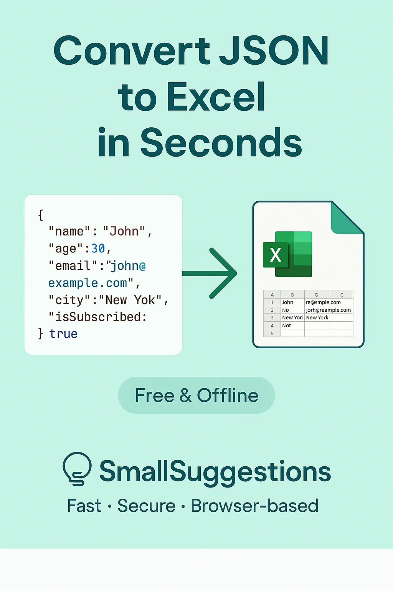
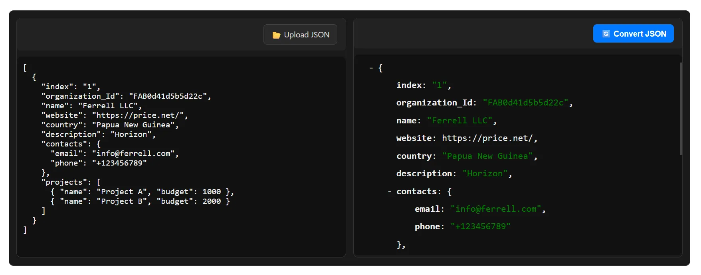
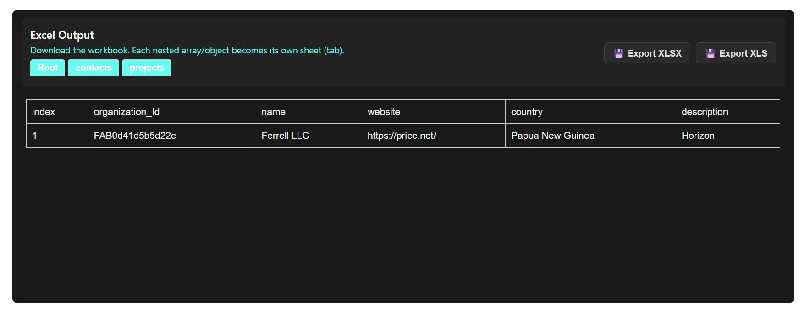

<h1 id="intro-heading">How To Open JSON File in Excel</h1>
<section class="blog-intro" aria-labelledby="intro-heading">
   

    Opening a JSON file in Excel can seem tricky if you’ve never worked with JSON data before. Unlike traditional spreadsheets, JSON files store information in a structured format, which Excel doesn’t natively display as a table. Whether you’re handling a small dataset or a large file exported from an API, knowing the right way to open and convert JSON into a readable Excel format can save you a lot of time and frustration.
  

   

     <a href="sohail-anwar" style="display:flex; gap: 10px;" class="link">
      
      Sohail Anwar
      </a>
      December 07, 2025
    

  <figure class="blog-image">
        
        <figcaption style="margin-top: -1.5rem; margin-bottom: 1rem; font-size: 8px">How to Convert JSON to Excel</figcaption>
 </figure>
  

    In this guide, we’ll walk you through simple steps to open a JSON file in Excel so that your data is clean, well-organized, and ready to work with. You’ll also learn tips to avoid common issues, such as nested arrays or missing columns, that often confuse beginners.
  

  <aside class="blog-tool-tip" aria-label="Recommended JSON to Excel Converter">
    

      For a faster, privacy-focused solution, try our 
      <a href="/json-to-excel" title="Free JSON to Excel Converter" class="link">free, browser-based JSON to Excel converter</a>. It works directly in your browser, doesn’t store your data, and lets you convert JSON files to Excel instantly — perfect for speed, privacy, and simplicity.
    

  </aside>

  

    By the end of this guide, you’ll know how to open JSON files in Excel the right way, whether manually or using our converter, and be able to work with your data efficiently.
  

</section>

<section aria-labelledby="tricky-heading">
    <h2 id="tricky-heading">Why Opening JSON in Excel Can Be Tricky</h2>
    

      JSON files store data in structured formats like nested arrays and objects, which Excel does not interpret natively. This often leads to issues such as missing columns, misaligned data, or parsing errors. Understanding these limitations helps you prepare your JSON file before importing or converting.
    

    <ul>
      <li>Nested arrays may not appear correctly in Excel tables.</li>
      <li>Large JSON files can slow down Excel.</li>
      <li>Different Excel versions handle JSON differently (2007, 2010, 2013, 2016, 2019, 365).</li>
    </ul>
</section>

<section aria-labelledby="method1-heading">
  <h2 id="method1-heading">Method 1: Open JSON in Excel Using Built-In Tools (Power Query)</h2>
  

    Excel comes with a powerful feature called <strong>Power Query</strong> (Get & Transform Data) that allows you to import JSON files directly. Ideal for users who prefer working within Excel without external tools, it works well for structured JSON files and gives you control over data transformation.
  

  
  <h3>Step-by-Step Guide:</h3>
  <ol>
    <li>Open Excel and go to <strong>Data &gt; Get Data &gt; From File &gt; From JSON</strong>.</li>
    <li>Select your JSON file from your computer and click <strong>Import</strong>.</li>
    <li>Excel will display a preview of the data. Use the <strong>Transform Data</strong> option to adjust nested arrays or columns as needed.</li>
    <li>Once satisfied, click <strong>Load</strong> to insert the structured data into your spreadsheet.</li>
  </ol>

  
<em>Pro Tips:</em>

  <ul>
    <li>Large JSON files may take longer to load — consider splitting them if necessary.</li>
    <li>Nested JSON objects may need flattening to appear correctly in Excel columns.</li>
    <li>Excel 2016 and later versions have slightly different menu names; check your version for exact steps.</li>
  </ul>
</section>

<section aria-labelledby="method2-heading">
  <h2 id="method2-heading">Method 2: Convert JSON to Excel Instantly Using Our Online Tool</h2>
  

    For a faster, browser-based approach, use our 
    <a href="/json-to-excel" class="link" title="JSON to Excel Converter">JSON to Excel converter</a>. Upload your JSON file and get a fully structured Excel sheet immediately.
  

  <h3>How to Use the Converter</h3>
  <ol>
    <li>
      <strong>Upload or Paste Your JSON:</strong> Use the editor to paste your JSON or click <strong>Upload JSON</strong> to select a file.  
      <figure class="blog-image">
        
        <figcaption>Paste or upload your JSON file</figcaption>
      </figure>
    </li>
    <li>
      <strong>Convert and Download Excel:</strong> Click <strong>Convert JSON</strong>. Nested arrays and objects are handled automatically.  
      <figure class="blog-image">
        
        <figcaption>Download your Excel file</figcaption>
      </figure>
    </li>
  </ol>

  <h3>Use Cases</h3>
  <ul>
    <li>Converting API JSON data into Excel for reporting and analysis.</li>
    <li>Handling GST JSON, ITR JSON, or AIS JSON files for accountants and businesses.</li>
    <li>Transforming large datasets exported from software or web apps into readable Excel sheets.</li>
  </ul>

  <aside class="blog-tool-tip" aria-label="Try the JSON to Excel Converter">
    

      Try the <a href="/json-to-excel" class="link" title="JSON to Excel Converter">JSON to Excel converter</a> today — fast, secure, and no installation required.
    

  </aside>
</section>

<section aria-labelledby="tips-heading">
  <h2 id="tips-heading">Tips for Converting JSON to Excel Effectively</h2>
  

    Follow these best practices to avoid errors and ensure your Excel sheets are clean and easy to work with:
  

  <ul>
    <li><strong>Flatten Nested Data:</strong> Use tools that automatically handle nested arrays and objects.</li>
    <li><strong>Check Column Consistency:</strong> Ensure all JSON objects have the same keys.</li>
    <li><strong>Use Proper Encoding:</strong> Save JSON files in UTF-8.</li>
    <li><strong>Break Large Files into Chunks:</strong> For very large JSON files, splitting improves performance.</li>
    <li><strong>Preview Your Data:</strong> Use JSON preview trees to validate before converting.</li>
    <li><strong>Handle Dates and Numbers Carefully:</strong> Ensure proper formatting after conversion.</li>
  </ul>
</section>

<section aria-labelledby="errors-heading">
  <h2 id="errors-heading">Common Errors When Converting JSON to Excel and How to Fix Them</h2>
  <ul>
    <li><strong>Parsing Errors:</strong> Validate JSON with a tool before importing.</li>
    <li><strong>Blank Cells:</strong> Ensure consistency across JSON objects; use converter if needed.</li>
    <li><strong>Special Characters:</strong> Save JSON in UTF-8 to prevent garbled text.</li>
    <li><strong>Version-Specific Quirks:</strong> Use modern Excel versions or our converter for full compatibility.</li>
  </ul>
</section>

<section aria-labelledby="conclusion-heading">
  <h2 id="conclusion-heading">Conclusion: Choose the Best Method for Your Needs</h2>
  

    Whether using Excel’s built-in tools or our 
    <a href="/json-to-excel" title="JSON to Excel Converter" class="link">browser-based JSON to Excel converter</a>, you can open any JSON file quickly and efficiently. For large or nested datasets, our converter is the fastest and most reliable option.
  

</section>
<section aria-labelledby="faq-heading-extended">
  <h2 id="faq-heading-extended">More FAQs About Opening JSON Files in Excel</h2>

  

    
How to open a JSON file in Excel 365?

    

      In Excel 365, you can use <strong>Data &gt; Get Data &gt; From File &gt; From JSON</strong> to import your JSON file. Power Query allows you to transform nested objects, arrays, and ensure proper formatting before loading it into a spreadsheet.
    

  

  

    
What is the best way to convert JSON to CSV for Excel?

    

      For CSV-friendly Excel sheets, use a browser-based JSON to CSV converter, or convert JSON via VS Code extensions. This approach ensures that nested structures are flattened and data is formatted for Excel tables.
    

  

  

    
Why do my JSON keys not match Excel columns?

    

      Mismatched columns often occur due to inconsistent keys across JSON objects or nested arrays. Use Power Query’s <strong>Transform Data</strong> feature or a converter that automatically maps nested keys to separate columns or sheets.
    

  

  

    
How can I preview JSON before converting to Excel?

    

      Most modern tools, including our <a href="/json-to-excel" title="JSON to Excel Converter" class="link">browser-based JSON to Excel converter</a>, provide a collapsible tree view preview. This helps verify your JSON structure, spot missing keys, and understand nested arrays before exporting.
    

  

  

    
Can I automate JSON to Excel conversion?

    

      Yes, using Excel macros, Power Query, or scripting languages like Python with Pandas, you can automate JSON to Excel conversion for recurring datasets. For manual one-off conversions, browser-based tools are faster and require no setup.
    

  

  

    
What file types can I export from JSON to Excel converters?

    

      Most converters allow exporting JSON files as <strong>XLSX</strong> or <strong>XLS</strong>. Nested JSON objects often generate separate sheets for easier data management.
    

  

  

    
How to fix blank cells after importing JSON to Excel?

    

      Blank cells usually appear when JSON objects have missing keys or arrays are uneven. Using our JSON to Excel converter ensures that all nested structures are handled correctly, minimizing blank cells and errors.
    

  

</section>

<label style="margin: 3rem;">You May Also Like</label>
  <ul style="margin-left: 2rem;">
   <li><a href ="how-to-convert-json-to-csv" class="link">Convert JSON To CSV</a></li>
   <li><a href ="how-to-convert-json-to-xml" class="link">Convert JSON To XML</a></li>
   <li><a href ="how-to-convert-json-to-pdf" class="link">Convert JSON To PDF</a></li>
  </ul>

<!-- Floating Video Wrapper -->

  

    <iframe id="ytplayer" 
      src="https://www.youtube.com/embed/0omvWpSkdrE?autoplay=1&mute=1&controls=1&modestbranding=1&rel=0"
      title="JSON to Excel Converter Tutorial"
      frameborder="0"
      allow="autoplay; encrypted-media"
      allowfullscreen>
    </iframe>
    <button class="fv-close" onclick="closeFloatingVideo()">x</button>
  

